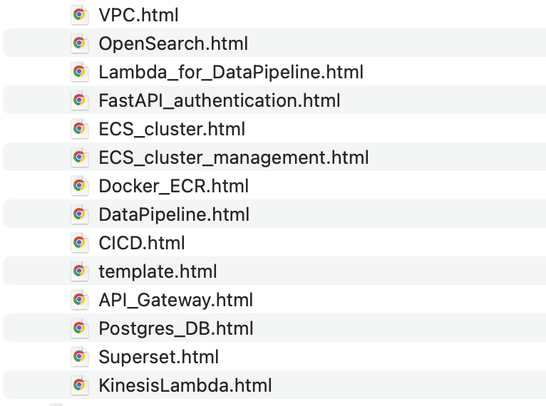

<style>
.post-content pre,
.post-content pre code {
  font-size: 0.82rem;
  line-height: 1.45;
}

.post-content pre {
  max-height: 36rem;
  overflow: auto;
}

.post-content .highlight .p,
.post-content .highlight .o {
    color: inherit;
}
</style>

In 2021, I landed a freelance project for which I built a 
neural search engine.
Pretty cool stuff for that time. 
The data preparation and model training took about 15% of the project 
time, and the rest was dedicated to building
microservice infrastructure on AWS.


(If you're curious about the ML part, it was a BERT-style model
up-trained on custom data for retrieval, and later trained on 
[SQuAD2.0 dataset](https://rajpurkar.github.io/SQuAD-explorer/), 
for answering domain-specific questions.)


At the time, I was in my 
[self-hosting-my-website-on-AWS era](/shipping-finally/), 
and the architecture implementation was going to 
end up on my website, but alas. 
It remained on my local computer.




I am not about to spend time trying to remember technical details. 
I wouldn't want an LLM to fill in the gaps either. 
But I bet these notes will get lost next time I need a new laptop. 

## Conclusion as Code

I really liked working on that project. 
CapEx, OpEx, and all that jazz - instead of being the consumer of
IT services, I was creating them left and right.
By the end of this project, I had done so much clicking and navigating 
of the console.
Needless to say, when I discovered Terraform, there was no going back. 


Today, that service is still up and running. 
But the half-finished posts make it feel unfinished. 

Instead of trying to untangle the technical details of the project 
into a cohesive piece of writing, 
I have asked an LLM to use my notes to 
retrospectively construct the Terraform code 
for the infrastructure of 2021.
 

```hcl
terraform {
  required_version = "~> 1.0.0"

  required_providers {
    aws = {
      source  = "hashicorp/aws"
      version = "~> 3.0"
    }
  }
}

provider "aws" {
  region = var.aws_region
}

variable "aws_region" {
  type    = string
  default = "us-east-1"
}

variable "name" {
  type    = string
  default = "REDACTED"
}

data "aws_caller_identity" "current" {}

data "aws_region" "current" {}
```

I am not going to vet the output more than redacting some identifying info.
My goal here is not to have working Terraform code. 
This is not a tutorial.


It's conclusion, as code. 

---

## The Infra

- [The network](#the-network)
- [Security groups](#security-groups)
- [S3](#s3)
- [OpenSearch and Search API](#opensearch-and-search-api)
- [ECS](#ecs)
- [And a bit of Lambda](#and-a-bit-of-lambda)

---

### The network

Trying to do everything by the books. 
Dedicated VPC, Internet Gateway, NAT Gateway, route tables. 

I remember starting with a four-subnet setup, and later moving on 
to six subnets, where two private subnets were reserved for the 
OpenSearch instances.

```hcl
variable "vpc_cidr" {
  type    = string
  default = "10.0.0.0/24"
}

variable "azs" {
  type    = list(string)
  default = ["us-east-1a", "us-east-1b"]
}

resource "aws_vpc" "this" {
  cidr_block           = var.vpc_cidr
  enable_dns_support   = true
  enable_dns_hostnames = true

  tags = {
    Name = "${var.name}-vpc"
  }
}

resource "aws_subnet" "public" {
  count = 2

  vpc_id                  = aws_vpc.this.id
  cidr_block              = cidrsubnet(var.vpc_cidr, 3, count.index)
  availability_zone       = var.azs[count.index]
  map_public_ip_on_launch = true

  tags = {
    Name = "${var.name}-public-${count.index + 1}"
  }
}

resource "aws_subnet" "private_app" {
  count = 2

  vpc_id            = aws_vpc.this.id
  cidr_block        = cidrsubnet(var.vpc_cidr, 3, count.index + 2)
  availability_zone = var.azs[count.index]

  tags = {
    Name = "${var.name}-private-app-${count.index + 1}"
  }
}

resource "aws_subnet" "private_data" {
  count = 2

  vpc_id            = aws_vpc.this.id
  cidr_block        = cidrsubnet(var.vpc_cidr, 3, count.index + 4)
  availability_zone = var.azs[count.index]

  tags = {
    Name = "${var.name}-private-data-${count.index + 1}"
  }
}

resource "aws_internet_gateway" "this" {
  vpc_id = aws_vpc.this.id

  tags = {
    Name = "${var.name}-igw"
  }
}

resource "aws_eip" "nat" {
  domain = "vpc"
}

resource "aws_nat_gateway" "this" {
  allocation_id = aws_eip.nat.id
  subnet_id     = aws_subnet.public[0].id

  depends_on = [aws_internet_gateway.this]
}

resource "aws_route_table" "public" {
  vpc_id = aws_vpc.this.id

  route {
    cidr_block = "0.0.0.0/0"
    gateway_id = aws_internet_gateway.this.id
  }
}

resource "aws_route_table" "private" {
  vpc_id = aws_vpc.this.id

  route {
    cidr_block     = "0.0.0.0/0"
    nat_gateway_id = aws_nat_gateway.this.id
  }
}

resource "aws_route_table_association" "public" {
  count = 2

  subnet_id      = aws_subnet.public[count.index].id
  route_table_id = aws_route_table.public.id
}

resource "aws_route_table_association" "private_app" {
  count = 2

  subnet_id      = aws_subnet.private_app[count.index].id
  route_table_id = aws_route_table.private.id
}

resource "aws_route_table_association" "private_data" {
  count = 2

  subnet_id      = aws_subnet.private_data[count.index].id
  route_table_id = aws_route_table.private.id
}
```

### Security groups

I think it's entirely possible that I did most of the clicking 
inside the security group tab of the VPC console. 

```hcl
resource "aws_security_group" "alb" {
  name        = "${var.name}-alb-sg"
  description = "ALB security group"
  vpc_id      = aws_vpc.this.id

  ingress {
    description = "HTTP from internet"
    from_port   = 80
    to_port     = 80
    protocol    = "tcp"
    cidr_blocks = ["0.0.0.0/0"]
  }

  egress {
    description     = "To ECS instances"
    from_port       = 0
    to_port         = 65535
    protocol        = "tcp"
    security_groups = [aws_security_group.ecs_instances.id]
  }

  tags = {
    Name = "${var.name}-alb-sg"
  }
}

resource "aws_security_group" "ecs_instances" {
  name        = "${var.name}-ecs-sg"
  description = "ECS EC2 instances for search API"
  vpc_id      = aws_vpc.this.id

  ingress {
    description     = "All TCP from ALB"
    from_port       = 0
    to_port         = 65535
    protocol        = "tcp"
    security_groups = [aws_security_group.alb.id]
  }

  egress {
    description = "Outbound anywhere"
    from_port   = 0
    to_port     = 0
    protocol    = "-1"
    cidr_blocks = ["0.0.0.0/0"]
  }

  tags = {
    Name = "${var.name}-ecs-sg"
  }
}

resource "aws_security_group" "lambda" {
  name        = "${var.name}-lambda-sg"
  description = "Lambda outbound only"
  vpc_id      = aws_vpc.this.id

  egress {
    description = "Outbound anywhere"
    from_port   = 0
    to_port     = 0
    protocol    = "-1"
    cidr_blocks = ["0.0.0.0/0"]
  }

  tags = {
    Name = "${var.name}-lambda-sg"
  }
}

resource "aws_security_group" "opensearch" {
  name        = "${var.name}-opensearch-sg"
  description = "OpenSearch access from ECS and pipeline/lambda"
  vpc_id      = aws_vpc.this.id

  ingress {
    description     = "HTTPS from ECS"
    from_port       = 443
    to_port         = 443
    protocol        = "tcp"
    security_groups = [aws_security_group.ecs_instances.id]
  }

  ingress {
    description     = "HTTPS from Lambda"
    from_port       = 443
    to_port         = 443
    protocol        = "tcp"
    security_groups = [aws_security_group.lambda.id]
  }

  ingress {
    description = "Self-reference for pipeline EC2 if reused"
    from_port   = 0
    to_port     = 65535
    protocol    = "tcp"
    self        = true
  }

  egress {
    description = "Outbound anywhere"
    from_port   = 0
    to_port     = 0
    protocol    = "-1"
    cidr_blocks = ["0.0.0.0/0"]
  }

  tags = {
    Name = "${var.name}-opensearch-sg"
  }
}
```

### S3

When I looked at the unpolished notes, I didn't want to try and make 
total sense of them. 
But looking at the Terraform code is like looking at a photo album. 
A memory of a memory. 

I am pretty sure I utilised S3 more than this snippet suggests.

```hcl
resource "aws_s3_bucket" "pipeline" {
  bucket = "${var.name}-pipeline-${data.aws_caller_identity.current.account_id}"

  tags = {
    Name = "${var.name}-pipeline"
  }
}

resource "aws_s3_bucket_versioning" "pipeline" {
  bucket = aws_s3_bucket.pipeline.id

  versioning_configuration {
    status = "Enabled"
  }
}
```

### OpenSearch and Search API

I remember the drama that was going on at the time, when 
[Elastic changed their licensing](https://www.elastic.co/pricing/faq/licensing) 
in protest of having their products used by AWS and 
other providers for profit.
OpenSearch was then conceived by AWS as a 
fork of ElasticSearch.


```hcl
variable "api_image_tag" {
  type    = string
  default = "latest"
}

variable "api_container_port" {
  type    = number
  default = 8000
}

variable "api_desired_count" {
  type    = number
  default = 3
}

variable "api_healthcheck_path" {
  type    = string
  default = "/health"
}

variable "opensearch_master_user" {
  type = string
}

variable "opensearch_master_password" {
  type      = string
  sensitive = true
}


resource "aws_lb" "api" {
  name               = "${var.name}-alb"
  load_balancer_type = "application"
  internal           = false
  security_groups    = [aws_security_group.alb.id]
  subnets            = aws_subnet.public[*].id

  tags = {
    Name = "${var.name}-alb"
  }
}

resource "aws_lb_target_group" "api" {
  name        = "${var.name}-tg"
  port        = var.api_container_port
  protocol    = "HTTP"
  vpc_id      = aws_vpc.this.id
  target_type = "instance"

  health_check {
    enabled             = true
    path                = var.api_healthcheck_path
    matcher             = "200"
    interval            = 30
    timeout             = 5
    healthy_threshold   = 2
    unhealthy_threshold = 3
  }

  tags = {
    Name = "${var.name}-tg"
  }
}

resource "aws_lb_listener" "http" {
  load_balancer_arn = aws_lb.api.arn
  port              = 80
  protocol          = "HTTP"

  default_action {
    type             = "forward"
    target_group_arn = aws_lb_target_group.api.arn
  }
}


resource "aws_opensearch_domain" "this" {
  domain_name    = replace(var.name, "-", "")
  engine_version = "OpenSearch_1.0"

  cluster_config {
    instance_type            = "t3.medium.search"
    instance_count           = 2
    zone_awareness_enabled   = true
    dedicated_master_enabled = false

    zone_awareness_config {
      availability_zone_count = 2
    }
  }

  ebs_options {
    ebs_enabled = true
    volume_size = 30
    volume_type = "gp3"
  }

  vpc_options {
    subnet_ids         = aws_subnet.private_data[*].id
    security_group_ids = [aws_security_group.opensearch.id]
  }

  advanced_security_options {
    enabled                        = true
    internal_user_database_enabled = true

    master_user_options {
      master_user_name     = var.opensearch_master_user
      master_user_password = var.opensearch_master_password
    }
  }

  domain_endpoint_options {
    enforce_https       = true
    tls_security_policy = "Policy-Min-TLS-1-2-2019-07"
  }

  encrypt_at_rest {
    enabled = true
  }

  node_to_node_encryption {
    enabled = true
  }

  access_policies = jsonencode({
    Version = "2012-10-17"
    Statement = [
      {
        Effect = "Allow"
        Principal = {
          AWS = "*"
        }
        Action   = "es:*"
        Resource = "${aws_opensearch_domain.this.arn}/*"
        Condition = {
          StringEquals = {
            "aws:PrincipalAccount" = data.aws_caller_identity.current.account_id
          }
        }
      }
    ]
  })

  tags = {
    Name = "${var.name}-opensearch"
  }
}
```

### ECS

The exciting stuff.

```bash
aws ecs update-service \
  --cluster REDACTED \
  --service REDACTED \
  --force-new-deployment
```

```hcl

variable "key_name" {
  type        = string
  description = "Existing EC2 key pair name for ECS instances"
}

variable "ecs_instance_type" {
  type    = string
  default = "c5a.xlarge"
}

variable "ecs_desired_capacity" {
  type    = number
  default = 2
}

variable "ecs_min_size" {
  type    = number
  default = 2
}

variable "ecs_max_size" {
  type    = number
  default = 5
}

resource "aws_ecr_repository" "api" {
  name                 = "${var.name}-api"
  image_tag_mutability = "MUTABLE"

  image_scanning_configuration {
    scan_on_push = true
  }
}


data "aws_ssm_parameter" "ecs_ami" {
  name = "/aws/service/ecs/optimized-ami/amazon-linux-2/recommended/image_id"
}

resource "aws_ecs_cluster" "this" {
  name = var.name

  setting {
    name  = "containerInsights"
    value = "enabled"
  }
}

resource "aws_iam_role" "ecs_instance" {
  name = "${var.name}-ecs-instance-role"

  assume_role_policy = jsonencode({
    Version = "2012-10-17"
    Statement = [{
      Effect = "Allow"
      Principal = {
        Service = "ec2.amazonaws.com"
      }
      Action = "sts:AssumeRole"
    }]
  })
}

resource "aws_iam_role_policy_attachment" "ecs_instance_ecs" {
  role       = aws_iam_role.ecs_instance.name
  policy_arn = "arn:aws:iam::aws:policy/service-role/AmazonEC2ContainerServiceforEC2Role"
}

resource "aws_iam_role_policy_attachment" "ecs_instance_ssm" {
  role       = aws_iam_role.ecs_instance.name
  policy_arn = "arn:aws:iam::aws:policy/AmazonSSMManagedInstanceCore"
}

resource "aws_iam_instance_profile" "ecs" {
  name = "${var.name}-ecs-instance-profile"
  role = aws_iam_role.ecs_instance.name
}

resource "aws_launch_template" "ecs" {
  name_prefix   = "${var.name}-ecs-"
  image_id      = data.aws_ssm_parameter.ecs_ami.value
  instance_type = var.ecs_instance_type
  key_name      = var.key_name

  vpc_security_group_ids = [aws_security_group.ecs_instances.id]

  iam_instance_profile {
    name = aws_iam_instance_profile.ecs.name
  }

  user_data = base64encode(<<-EOF
    #!/bin/bash
    echo ECS_CLUSTER=${aws_ecs_cluster.this.name} >> /etc/ecs/ecs.config
  EOF
  )

  block_device_mappings {
    device_name = "/dev/xvda"

    ebs {
      volume_size = 30
      volume_type = "gp3"
      encrypted   = true
    }
  }

  tag_specifications {
    resource_type = "instance"

    tags = {
      Name = "${var.name}-ecs"
    }
  }
}

resource "aws_autoscaling_group" "ecs" {
  name                = "${var.name}-ecs-asg"
  min_size            = var.ecs_min_size
  max_size            = var.ecs_max_size
  desired_capacity    = var.ecs_desired_capacity
  vpc_zone_identifier = aws_subnet.private_app[*].id
  health_check_type   = "EC2"

  launch_template {
    id      = aws_launch_template.ecs.id
    version = "$Latest"
  }

  tag {
    key                 = "Name"
    value               = "${var.name}-ecs"
    propagate_at_launch = true
  }

  tag {
    key                 = "AmazonECSManaged"
    value               = "true"
    propagate_at_launch = true
  }
}

resource "aws_ecs_capacity_provider" "this" {
  name = "${var.name}-cp"

  auto_scaling_group_provider {
    auto_scaling_group_arn = aws_autoscaling_group.ecs.arn

    managed_scaling {
      status          = "ENABLED"
      target_capacity = 100
    }
  }
}

resource "aws_ecs_cluster_capacity_providers" "this" {
  cluster_name = aws_ecs_cluster.this.name

  capacity_providers = [aws_ecs_capacity_provider.this.name]

  default_capacity_provider_strategy {
    capacity_provider = aws_ecs_capacity_provider.this.name
    weight            = 1
  }
}

resource "aws_iam_role" "ecs_task_execution" {
  name = "${var.name}-ecs-task-exec"

  assume_role_policy = jsonencode({
    Version = "2012-10-17"
    Statement = [{
      Effect = "Allow"
      Principal = {
        Service = "ecs-tasks.amazonaws.com"
      }
      Action = "sts:AssumeRole"
    }]
  })
}

resource "aws_iam_role_policy_attachment" "ecs_task_execution_default" {
  role       = aws_iam_role.ecs_task_execution.name
  policy_arn = "arn:aws:iam::aws:policy/service-role/AmazonECSTaskExecutionRolePolicy"
}

resource "aws_iam_role_policy" "ecs_task_extra" {
  name = "${var.name}-ecs-task-extra"
  role = aws_iam_role.ecs_task_execution.id

  policy = jsonencode({
    Version = "2012-10-17"
    Statement = [
      {
        Effect = "Allow"
        Action = [
          "es:ESHttpGet",
          "es:ESHttpPost",
          "es:ESHttpPut",
          "es:ESHttpDelete",
          "es:DescribeDomain"
        ]
        Resource = "${aws_opensearch_domain.this.arn}/*"
      },
      {
        Effect = "Allow"
        Action = [
          "ssm:GetParameter",
          "ssm:GetParameters"
        ]
        Resource = "*"
      }
    ]
  })
}


resource "aws_cloudwatch_log_group" "api" {
  name              = "/ecs/${var.name}-api"
  retention_in_days = 14
}

resource "aws_ecs_task_definition" "api" {
  family                   = "${var.name}-api"
  network_mode             = "bridge"
  requires_compatibilities = ["EC2"]
  execution_role_arn       = aws_iam_role.ecs_task_execution.arn
  task_role_arn            = aws_iam_role.ecs_task_execution.arn

  container_definitions = jsonencode([
    {
      name      = "search-api"
      image     = "${aws_ecr_repository.api.repository_url}:${var.api_image_tag}"
      essential = true
      cpu       = 512
      memory    = 2048

      portMappings = [
        {
          containerPort = var.api_container_port
          hostPort      = 0
          protocol      = "tcp"
        }
      ]

      environment = [
        {
          name  = "OPENSEARCH_ENDPOINT"
          value = "https://${aws_opensearch_domain.this.endpoint}"
        },
        {
          name  = "OPENSEARCH_INDEX"
          value = "REDACTED"
        }
      ]

      logConfiguration = {
        logDriver = "awslogs"
        options = {
          awslogs-group         = aws_cloudwatch_log_group.api.name
          awslogs-region        = var.aws_region
          awslogs-stream-prefix = "ecs"
        }
      }
    }
  ])
}

resource "aws_ecs_service" "api" {
  name            = "REDACTED"
  cluster         = aws_ecs_cluster.this.id
  task_definition = aws_ecs_task_definition.api.arn
  desired_count   = var.api_desired_count

  deployment_minimum_healthy_percent = 50
  deployment_maximum_percent         = 200

  ordered_placement_strategy {
    type  = "spread"
    field = "attribute:ecs.availability-zone"
  }

  capacity_provider_strategy {
    capacity_provider = aws_ecs_capacity_provider.this.name
    weight            = 1
  }

  load_balancer {
    target_group_arn = aws_lb_target_group.api.arn
    container_name   = "search-api"
    container_port   = var.api_container_port
  }

  depends_on = [aws_lb_listener.http]
}

resource "aws_appautoscaling_target" "ecs_service" {
  max_capacity       = 5
  min_capacity       = 2
  resource_id        = "service/${aws_ecs_cluster.this.name}/${aws_ecs_service.api.name}"
  scalable_dimension = "ecs:service:DesiredCount"
  service_namespace  = "ecs"
}

resource "aws_appautoscaling_policy" "ecs_cpu" {
  name               = "${var.name}-cpu-target"
  policy_type        = "TargetTrackingScaling"
  resource_id        = aws_appautoscaling_target.ecs_service.resource_id
  scalable_dimension = aws_appautoscaling_target.ecs_service.scalable_dimension
  service_namespace  = aws_appautoscaling_target.ecs_service.service_namespace

  target_tracking_scaling_policy_configuration {
    target_value = 75

    predefined_metric_specification {
      predefined_metric_type = "ECSServiceAverageCPUUtilization"
    }
  }
}
```

### And a bit of Lambda

Naturally.

```hcl
resource "aws_iam_role" "lambda" {
  name = "${var.name}-search-update-role"

  assume_role_policy = jsonencode({
    Version = "2012-10-17"
    Statement = [{
      Effect = "Allow"
      Principal = {
        Service = "lambda.amazonaws.com"
      }
      Action = "sts:AssumeRole"
    }]
  })
}

resource "aws_iam_role_policy_attachment" "lambda_basic" {
  role       = aws_iam_role.lambda.name
  policy_arn = "arn:aws:iam::aws:policy/service-role/AWSLambdaBasicExecutionRole"
}

resource "aws_iam_role_policy_attachment" "lambda_vpc" {
  role       = aws_iam_role.lambda.name
  policy_arn = "arn:aws:iam::aws:policy/service-role/AWSLambdaVPCAccessExecutionRole"
}

resource "aws_iam_role_policy" "lambda_custom" {
  name = "${var.name}-lambda-custom"
  role = aws_iam_role.lambda.id

  policy = jsonencode({
    Version = "2012-10-17"
    Statement = [
      {
        Effect = "Allow"
        Action = [
          "s3:GetObject",
          "s3:PutObject"
        ]
        Resource = "${aws_s3_bucket.pipeline.arn}/*"
      },
      {
        Effect = "Allow"
        Action = [
          "datapipeline:ActivatePipeline",
          "datapipeline:DescribePipelines",
          "datapipeline:QueryObjects"
        ]
        Resource = "*"
      }
    ]
  })
}

resource "aws_lambda_function" "search_update" {
  function_name = "search-update"
  role          = aws_iam_role.lambda.arn
  handler       = "lambda_function.lambda_handler"
  runtime       = "python3.11"
  timeout       = 60

  filename         = "lambda/search-update.zip" 
  source_code_hash = filebase64sha256("lambda/search-update.zip")

  vpc_config {
    subnet_ids         = aws_subnet.private_app[*].id
    security_group_ids = [aws_security_group.lambda.id]
  }

  environment {
    variables = {
      PIPELINE_BUCKET    = aws_s3_bucket.pipeline.bucket
      CURRENT_INDEX_KEY  = "state/REDACTED.txt"
      NEW_INDEX_KEY      = "state/REDACTED.txt"
      DATAPIPELINE_ID    = "REPLACE_ME"
      ECS_CLUSTER_NAME   = aws_ecs_cluster.this.name
      ECS_SERVICE_NAME   = aws_ecs_service.api.name
      ECR_REPOSITORY_URL = aws_ecr_repository.api.repository_url
    }
  }
}

resource "aws_cloudwatch_event_rule" "daily" {
  name                = "${var.name}-daily-search-update"
  schedule_expression = "cron(0 3 * * ? *)"
}

resource "aws_cloudwatch_event_target" "lambda" {
  rule      = aws_cloudwatch_event_rule.daily.name
  target_id = "SearchUpdateLambda"
  arn       = aws_lambda_function.search_update.arn
}

resource "aws_lambda_permission" "allow_events" {
  statement_id  = "AllowExecutionFromEventBridge"
  action        = "lambda:InvokeFunction"
  function_name = aws_lambda_function.search_update.function_name
  principal     = "events.amazonaws.com"
  source_arn    = aws_cloudwatch_event_rule.daily.arn
}
```

Q.E.D.
